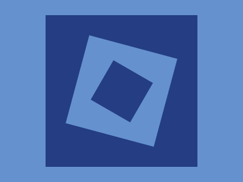

# Web Development Class - I

## Web Development Class - I ppt: [Here](https://docs.google.com/presentation/d/1REIIBI9e6xlYWzRnaIWlRgOZc8L0bHQ5DyRki6PZnwk/edit?usp=sharing)

#### AUG 25, 2022

<div align="center"></div>

<hr>

### Material
* [W3Schools HTML Tutorial](https://www.w3schools.com/html/).
* [scrimba interactive course](https://scrimba.com/learn/htmlandcss)
* [The Complete HTML cheatsheet](./The-Complete-HTML-Cheat-Sheet.pdf)
* [challenge](#challenge)

<div align="center"><h2>HTML</h2></div>

*	### What is HTML?
	* HTML stands for **Hyper Text Markup Language**.
	* HTML is used to create web pages and web applications.
	* We can create a static website by HTML only.
	* Technically, HTML is a **Markup language** (helps to format the overall view of a page and the data it contains) rather than a programming language.


*	### Basic Structure of HTML file
	* `<!DOCTYPE html>` tag indicates **HTML 5** document.
	* `<html>` tag is the container for all other HTML elements (except `<!DOCTYPE html>`).
	* The `<head>` element is a container for metadata (data about data) and is placed between the `<html>` tag and the `<body>` tag.
	* Metadata typically define the document title, character set, styles, scripts, and other meta information.
	* The `<body>` element contains all the contents of an HTML document, such as headings, paragraphs, images, hyperlinks, tables, lists, etc.

	#### [structure.html](./structure.html)
	```html
	<!DOCTYPE html>
	<html>
	   <head>
	      <title>This is document title</title>
	   </head>	
	   <body>
	      <h1>This is a heading</h1>
	      <p>Hello World!</p>
	   </body>	
	</html>
	```

*	### HTML Tags
	* HTML tags are like keywords which defines that how web browser will format and display the content.
	* With the help of tags, a web browser can distinguish between an HTML content and a simple content.
	* *Generally*, HTML tags contain three main parts: **opening tag**, **content** and **closing tag**.
	* *Example*:
	```html
	<p> This is an HTML tutorial </p>
	```
	* Some tags need not be closed. Example: `<br>`, `<hr>`, etc.
	* Some **attributes** are present in each tag which define properties of that tag.

<div align="center"><h2>CSS</h2></div>

*	### What is CSS?
	* CSS stands for **Cascading style sheets**.
	* CSS is the language we use to style an HTML document.

	* CSS describes how HTML elements should be displayed.


*	### Add to project
	* **External** (create a file and use its path in the `<link>` element in the file).
		```html
		<head>
			<link rel="stylesheet" href="relative path to css file">
		</head>
		```
	* **Internal** (using <style> tag).
		```html
		<style>
			body {background-color: powderblue;}
			h1   {color: blue;}
			p    {color: red;}
		</style>
		```
	* **Inline** (using style attribute in tags).

		```html
		<h1 style="color:blue;">A Blue Heading</h1>
		```

*	### CSS Syntax
    

	Css selectors:
	* Simple selectors(ex: id,class, tagname)
	* Attribute selectors(select on basis of attribute)
	* Pseudo-class selectors(select elements based on certain state)
	* Universal selector(*)


#### note: download the files or use [this](https://scrimba.com/scrim/cnDZqLhv?a=12120.0.1.L12_4) link, and try to play with code 

## challenge
try to make this shape using html and css

challenge [link](https://cssbattle.dev/play/37)

## Content Contributors

* [Lovedeep Singh kamal](https://github.com/dev-lovedeep/)


